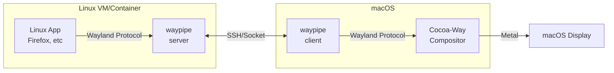

# Cocoa-Way

<div align="center">

[](https://github.com/J-x-Z/cocoa-way/releases)
[](https://github.com/J-x-Z/cocoa-way/actions)
[](https://www.gnu.org/licenses/gpl-3.0)
[](https://www.rust-lang.org/)
[](https://www.apple.com/macos/)
[](https://github.com/rust-unofficial/awesome-rust)
[](https://github.com/jaywcjlove/awesome-mac)

**Native macOS Wayland compositor for running Linux apps seamlessly**

[Demo Video](#-demo-video) • [Install](#-installation) • [Quick Start](#-quick-start) • [Architecture](#-architecture)

</div>

---

## Demo Video

[](https://youtu.be/VS3vQp5i8YQ)

> *True protocol portability: Cocoa-Way rendering Linux apps from SSH hosts, Docker, OrbStack, and Apple Container.*

## Features

| Feature                               | Description                                               |
| ------------------------------------- | --------------------------------------------------------- |
| **Native macOS**                | Metal rendering                                           |
| **Compositor Zero VM Overhead** | Direct Wayland protocol via socket, no virtualization     |
| **HiDPI Ready**                 | Optimized for Retina displays with proper scaling         |
| **Polished UI**                 | Server-side decorations with shadows and focus indicators |
| **Hardware Accelerated**        | Efficient Metal rendering pipeline                       |

## Installation

### Homebrew (Recommended)

```bash
brew tap J-x-Z/tap
brew install cocoa-way waypipe-darwin
```

### Download Binary

Download the latest `.dmg` or `.zip` from [Releases](https://github.com/J-x-Z/cocoa-way/releases).

### Build from Source

```bash
# Install dependencies
brew install libxkbcommon pixman pkg-config

# Clone and build
git clone https://github.com/J-x-Z/cocoa-way.git
cd cocoa-way
cargo build --release
```

## Quick Start

> ⚠️ **Required:** You must install [waypipe-darwin](https://github.com/J-x-Z/waypipe-darwin) to connect Linux apps.
>
> ```bash
> brew tap J-x-Z/tap && brew install waypipe-darwin
> ```

1. **Start the compositor:**

   ```bash
   cocoa-way
   ```
2. **Connect Linux apps via SSH:**

   ```bash
   ./run_waypipe.sh ssh user@linux-host firefox
   ```

3. **Or use `Connections > Connect to Machine...` in the macOS menu:**

   Enter `user@host`, the application, and an optional display slot. Enable **Save this connection for later** to add it to the Connections menu immediately. Saved entries are written to `~/.config/cocoa-way/connections.toml` with private file permissions; passwords are never stored.

4. **Add persistent container sessions in `~/.config/cocoa-way/container-sessions.toml`:**

   ```toml
   [[session]]
   name = "Niri Desktop (Apple Container)"
   runtime = "container"
   image = "localhost/cocoa-way-niri:latest"
   profile = "niri"
   command = "niri"
   ```

   Then use the Container menu inside Cocoa-Way to launch the session.

### Container Runtimes

Cocoa-Way has two control modes: Classic connections for SSH / local sockets, and Container Mode for local Linux GUI sessions managed by Cocoa-Way.

- `runtime = "container"` uses Apple's official [`container`](https://github.com/apple/container) CLI. Apple documents it as requiring Apple silicon and macOS 26+, and you must start its background service first with `container system start`.
- `runtime = "docker"` works with Docker Desktop and compatible CLIs.
- `runtime = "orb"` or `runtime = "orbstack"` works with OrbStack.

For Apple Container, Cocoa-Way prefers Transport V2: a multiplexed waypipe relay carried by `container run --publish-socket`. If that capability is unavailable or fails during startup, Cocoa-Way falls back to its stdio compatibility relay automatically. For Docker and OrbStack, Cocoa-Way bind-mounts the host socket directory into the container and connects over that local socket.

Container Mode can assign `display = "auto"`, `display = "default"`, or a stable named display to a session. `auto` uses the main compositor window when it is free and creates a dedicated Cocoa-Way display window when another GUI session already occupies it.

The Apple Container, Docker, and OrbStack pages expose runtime status, container lifecycle controls, logs, resource usage, and terminal access. Stopping OrbStack pauses Docker-compatible inventory polling so Cocoa-Way does not wake the service again while it is intentionally stopped.

### Local Control

The compositor exposes a local Unix-socket control API while it is running. `cocoa-wayctl` provides JSON-friendly status and lifecycle commands without bypassing the GUI's safety checks:

```bash
cocoa-wayctl --json status
cocoa-wayctl sessions
cocoa-wayctl launch "Niri Desktop (Apple Container)"
```

`cocoa-way-mcp` is an optional, local stdio adapter over the same API. Its MCP tools are read-only by design: status, sessions, displays, images, and recent logs. Launch, stop, and destructive resource operations are not exposed to AI clients.

## Architecture



## Comparison

| Solution            | Latency | HiDPI        | Native Integration | Setup Complexity |
| ------------------- | ------- | ------------ | ------------------ | ---------------- |
| **Cocoa-Way** | ⚡ Low  | ✅           | ✅ Native windows  | 🟢 Easy          |
| XQuartz             | 🐢 High | ⚠️ Partial | ⚠️ X11 quirks    | 🟡 Medium        |
| VNC                 | 🐢 High | ❌           | ❌ Full screen     | 🟡 Medium        |
| VM GUI              | 🐢 High | ⚠️ Partial | ❌ Separate window | 🔴 Complex       |

## Roadmap

- [X] macOS backend (METAL)
- [X] Waypipe integration
- [X] HiDPI scaling
- [X] winit update
- [ ] Multi-monitor support
- [X] Clipboard sync

## next step
new gui

1.1.0 soon


## Troubleshooting

<details>
<summary><b>SSH: "remote port forwarding failed"</b></summary>

A stale socket file exists on the remote host. Our `run_waypipe.sh` script handles this automatically with `-o StreamLocalBindUnlink=yes`.

If running manually:

```bash
waypipe ssh -o StreamLocalBindUnlink=yes user@host ...
```

</details>

<details>
<summary><b>Apple Container support checklist</b></summary>

```bash
container system start
container run --rm -it ubuntu:24.04 /bin/bash
```

If Cocoa-Way cannot launch a configured Apple Container connection:

- Verify the `container` CLI is installed and available in `/usr/local/bin/container` or your `PATH`.
- Make sure the image contains `waypipe` and the app you configured in `app = "..."`.
- On first run, try a shell as the app command to confirm the image itself starts cleanly.

</details>

<details>
<summary><b>Can Cocoa-Way run local X11 apps directly?</b></summary>

Not yet. Cocoa-Way is focused on Wayland clients transported over waypipe. Running same-machine X11 apps as a full XQuartz replacement is still an open gap.

</details>

## Contributing

Contributions welcome! Please open an issue first to discuss major changes.

## License

[GPL-3.0](LICENSE) - Copyright (c) 2024-2025 J-x-Z
